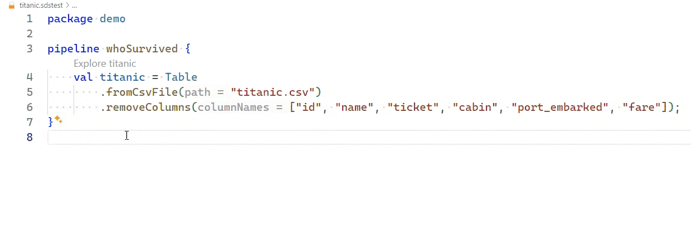

# Safe-DS DSL

Safely develop Data Science programs with a statically checked domain specific language (DSL) and integrated tools for data
inspection.

## Installation

To set up a powerful _integrated development environment_ (_IDE_) for Safe-DS, follow these steps:

1. **Install [Visual Studio Code](https://code.visualstudio.com/)** (VS Code).
2. **Install the [Safe-DS extension](https://marketplace.visualstudio.com/items?itemName=safe-ds.safe-ds)** for VS Code.

To run Safe-DS programs, you also need the [Safe-DS Runner](https://github.com/Safe-DS/Runner):

1. **Install [Python](https://www.python.org/) (3.11 or 3.12)**. Make sure to add Python to your
   system's `PATH` during installation. Verify installation by running `python --version` in a
   command line. You should get output similar to `Python 3.12.2`.
2. **Open VS Code**.
3. **Open the command palette** (Menu bar > View > Command Palette).
4. **Type `Install the Safe-DS Runner`**.
5. **Press ++enter++**. Installation may take a few minutes, since it downloads and installs several large libraries
   like PyTorch.

## Documentation

You can find the full documentation [here](https://dsl.safeds.com).

## Contributing

We welcome contributions from everyone. As a starting point, check the following resources:

* [Contributing page](https://github.com/Safe-DS/DSL/contribute)

If you need further help, please [use our discussion forum][forum].

[forum]: https://github.com/orgs/Safe-DS/discussions
