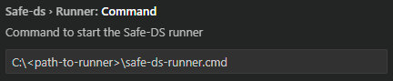

# Safe-DS DSL

Safely develop Data Science programs with a statically checked domain specific language (DSL).

## Installation

1. Get the latest extension for [Visual Studio Code](https://code.visualstudio.com/) from the
   [Visual Studio Marketplace](https://marketplace.visualstudio.com/items?itemName=safe-ds.safe-ds). This sets up a
   complete _development environment_ for Safe-DS programs.
2. To _execute_ Safe-DS programs, the [Safe-DS Runner](https://github.com/Safe-DS/Runner) has to be installed and
   configured additionally:
    1. Install [Python](https://www.python.org/) (3.11 or 3.12).
    2. Run `pip install "safe-ds-runner>=0.9.0,<0.10.0"` in a command line to download the latest matching Runner version
       from [PyPI](https://pypi.org/project/safe-ds-runner/).
    3. If the Visual Studio Code extension cannot start the runner, adjust the setting `safe-ds.runner.command`.
       Enter the absolute path to the Runner executable, as seen in the image below.

        

## Documentation

You can find the full documentation [here](https://dsl.safeds.com).

## Contributing

We welcome contributions from everyone. As a starting point, check the following resources:

* [Contributing page](https://github.com/Safe-DS/DSL/contribute)

If you need further help, please [use our discussion forum][forum].

[forum]: https://github.com/orgs/Safe-DS/discussions
