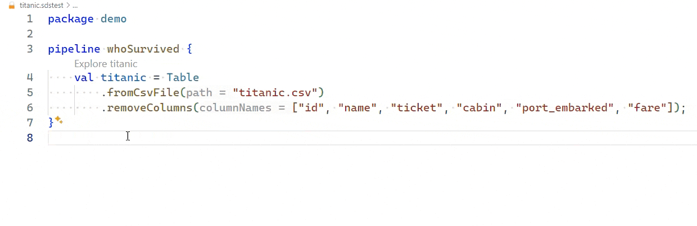

---
hide:
  - navigation
---

# Safe-DS DSL

Safely develop Data Science programs with a statically checked domain specific language (DSL) and integrated tools for
data inspection.

{ max-width="400" }

## Using this Documentation

If you look for information about a specific topic, use the search bar at the top of this page. Otherwise, use the
navigational elements to reach one of the following sections:

| Section                                                  | Description                                                                                      |
|----------------------------------------------------------|--------------------------------------------------------------------------------------------------|
| [Getting Started](getting-started/installation.md)       | Learn how to configure a development environment for Safe-DS and write your first program.       |
| [Language Reference](pipeline-language/README.md)        | Learn about the concepts of the Safe-DS language.                                                |
| [API Reference][safeds.data.image.containers.Image]      | Learn about the API elements that you can use in Safe-DS programs, like classes and functions.   |
| [Integrating New Libraries](stub-language/README.md)     | Learn how to integrate new libraries into Safe-DS (:warning: documentation is work in progress). |
| [Development](development/testing/call-graph-testing.md) | Learn about various aspects of developing Safe-DS itself.                                        |

## Contributing

We welcome contributions from everyone, be it a new feature, a bugfix, better documentation, or something else. As a
starting point, check the following resources:

* [Contributing page](https://github.com/Safe-DS/DSL/contribute)
* [Open issues](https://github.com/Safe-DS/DSL/issues)

## Getting Help

If you need further help, please [use our discussion forum](https://github.com/orgs/Safe-DS/discussions).
