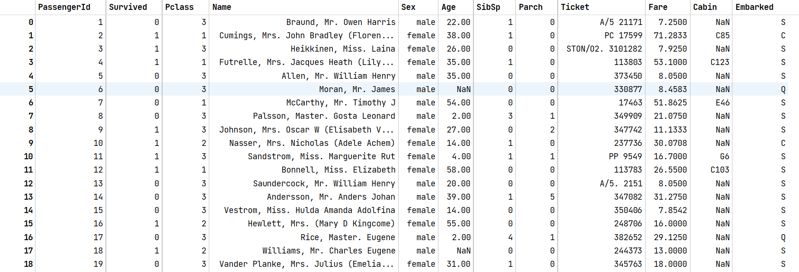
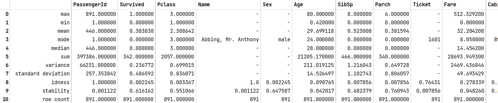

# Example: Titanic

In this tutorial we are going to use a classic machine learning example: The Titanic Disaster.

!!! note
    The dataset we are using is provided by [kaggle](https://www.kaggle.com/c/titanic) and the outputs are generated in a Jupyter Notebook.

## Import

First we import the dataset as a [`Table`][safeds.data.tabular.Table].
```python
from safe_ds.data import Table
data = Table.from_csv("path/to/data/train.csv")
```

## Data Visualization and Analysis

Now we can start to analyze it.
```python
display(data)
```


```python
data.summary()
```


```python
from safe_ds.plotting import plot_correlation_heatmap
plot_correlation_heatmap(data)
```


```python
for column_name in data.get_column_names():
    if data.get_column(column_name).has_missing_values():
        print(column_name)   # prints 'Age', 'Cabin' and 'Embarked'
```

!!! notes
    If you want to learn more about **Data Visualization** click [here](docs/Stdlib/python/Tutorials/visualization.md).

## Data Preparation


After having a look at these results we can notice a few things.

Firstly, the idness of the column *PassengerId* is 1 which means, that every row has a unique value.
For machine learning this is not useful, so we are going to drop it.

Also not useful are *Name* and *Ticket*.

There are three columns that contain empty values. In this example application we'll drop *Cabin* and *Embarked* and use
the [`Imputer`][safeds.data.tabular.transformation.Imputer] to fill the missing values of the feature *Age* with the mean.


[comment]: <> (We should use remove_outliers here, but the method is currently broken)

```python
from safe_ds.data import Imputer

data = data.drop_columns(["PassengerId", "Name", "Ticket", "Cabin", "Embarked"])

mean_imputer = Imputer(Imputer.Strategy.Mean())
data = mean_imputer.fit_transform(data, ["Age"])
```

We also want to make sure, that we don't carry any unnecessary [duplicate rows][safeds.data.tabular.Table.drop_duplicate_rows].
```python
data = data.drop_duplicate_rows()
```

In the end we need to prepare our training data. We are going to [split][safeds.data.tabular.Table.split] the dataset that we have into training (80%) and testing sets (20%).
```python
training_set, testing_set = data.split(0.8)
```

We'll convert the training set into a [`SupervisedDataset`][safeds.data.SupervisedDataset] by defining what feature we are targeting and we'll also
remove the target feature from our testing set.

!!! note
    If we want to compare our predication later against a known truth we need to save it.
```python
from safe_ds.data import SupervisedDataset

supervised_training_set = SupervisedDataset(training_set, "Survived")

known_truth = testing_set.get_column("Survived")
testing_set = testing_set.drop_columns(["Survived"])
```

!!! notes
    If you want to learn more about **Data Processing** click [here](/docs/Stdlib/python/Tutorials/data_processing.md).

## Choosing a Model


Now that we have prepared our data we can think about what model we want to choose. For now we'll just use the [`RandomForest`][safeds.ml.classification.RandomForest] classifier.

```python
from safe_ds.classification import RandomForest

model = RandomForest()
```

!!! notes
        If you want to learn more about **Machine Learning Models** or the [`SupervisedDataset`][safeds.data.SupervisedDataset] click [here](/docs/Stdlib/python/Tutorials/machine_learning.md).

## Train and Predict


Now we train our model and use it to predict the survival rate for our testing set.

```python
model.fit(supervised_training_set)
prediction = model.predict(testing_set)
```
!!! note
    The return value of [`model.predict()`][safeds.ml.classification.RandomForest.predict] is a Table containing the given feature vectors and the predicted target vector. The name of our target vector in the prediction table is derived from the name of the target vector in the [`SupervisedDataset`][safeds.data.SupervisedDataset]. You can also provide a different name.

```python
prediction = model.predict(testing_set, target_name="Something_Else")
```

## Evaluation and Export


Now we can evaluate how accurate our model is and save our prediction as a .csv file.
```python
from safe_ds.classification.metrics import accuracy

prediction_accuracy = accuracy(known_truth, prediction.get_column("Survived"))
prediction.to_csv("path/to/output/prediction.csv")
```
