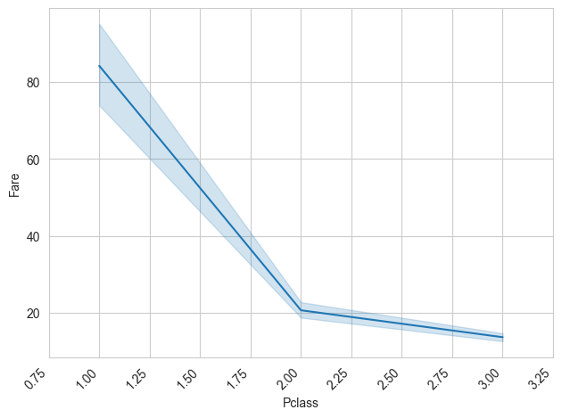
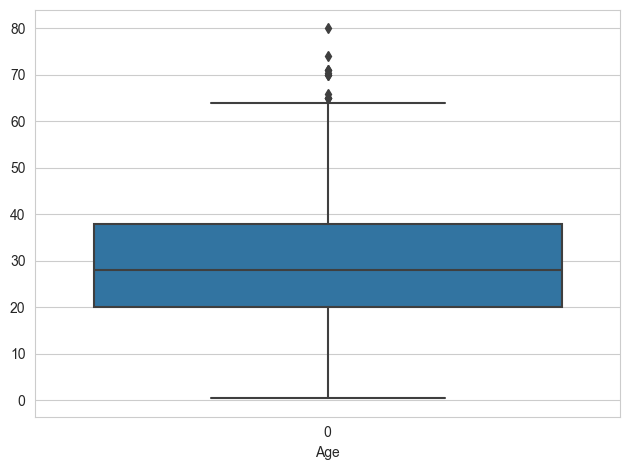
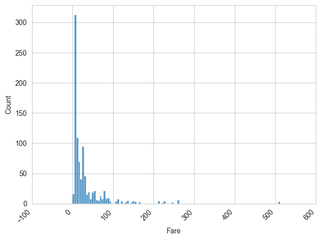
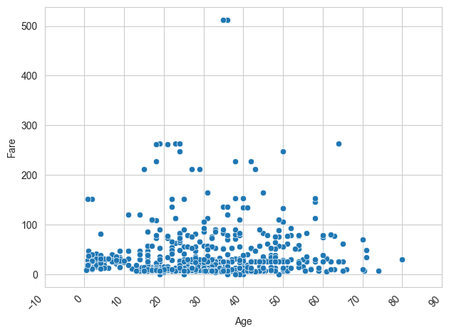

# Visualization

The following code will use a Jupyter Notebook environment.

## Table & Statistics
First, we need some data to visualize. For this, we use the common example of the titanic disaster.

!!! note
    You can download that dataset on [kaggle](https://www.kaggle.com/c/titanic).

```python
from safeds.data.tabular import Table
data = Table.from_csv("path/to/your/data.csv")
```

To begin our data exploration, we want to have a rough overview of what our data looks like.
Without modifying or selecting anything specific, we will start by simply displaying our data.
For this, we use Jupyter Notebook's native display function.

```python
data    # calls display(data)
```


As a next step, we will use safe-DS's [`summary()`][safeds.data.tabular._table.Table.summary]-method, which returns a table with some key statistics for each column in our data.

```python
data.summary()  # returns a table with various statistics for each column
```


As you can see here, the **idness** of the column _PassengerId_ is 1. This means that every row has a unique value for
this column. Since this isn't helpful for our usecase, we will [drop][safeds.data.tabular._table.Table.drop_columns] it.

```python
data_cleaned = data.drop_columns(["PassengerId"])
```
## Heatmap
Now we have a rough idea of what we are dealing with. But there is still a lot we do not know about the dataset.
A good next step is to start plotting our columns against each other.
One way to gain a quick understanding of how the different columns relate to each other is a [Heatmap][safeds.plotting._correlation_heatmap].

However, this type of diagram works exclusively for numerical data. We are therefore going drop all non-numerical columns.
safe-DS's [`list_columns_with_numerical_values()`][safeds.data.tabular._table.Table.list_columns_with_numerical_values]-method
offers a quick way to do just that.


```python
from safeds.plotting import correlation_heatmap

data_only_numerics = Table.from_columns(data_cleaned.list_columns_with_numerical_values())
correlation_heatmap(data_only_numerics)
```


As you can see, the columns _Fare_ and _Pclass_ (Passenger Class) seem to heavily correlate. Let's have another look at that.
## Lineplot
We'll use a [lineplot][safeds.plotting._lineplot] to better understand their relationship, which is one way to visualise the relationship between two variables easily.

```python
from safeds.plotting import lineplot
lineplot(data_cleaned, "Pclass", "Fare")
```



The line itself represents the central tendency, while the lighter-coloured surrounding area shows the 95% confidence interval for that estimate.

We can infer that tickets for "First Class"-rooms (Pclass = 1.0) are much more expensive compared to second (Pclass = 2.0) and third (Pclass = 3.0) class.
Also, the difference between second and third is less pronounced.

## Other plots
Some other plots that might be useful to understanding our data and relationships within it are [boxplots][safeds.plotting._boxplot], [histograms][safeds.plotting._histogram] and [scatterplots][safeds.plotting._scatterplot].

```python
from safeds.plotting import boxplot

boxplot(data_cleaned.get_column("Age"))
```



```python
from safeds.plotting import histogram

histogram(data_cleaned.get_column("Fare"))
```


```python
from safeds.plotting import scatterplot

scatterplot(data_cleaned, "Age", "Fare")
```


